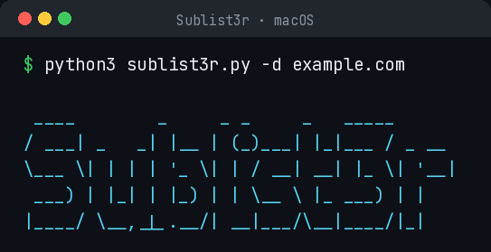

<h1 align="center">Sublist3r <sub>· for macOS</sub></h1>

<p align="center"><b>Fast subdomain enumeration on macOS — Apple Silicon & Intel native.</b></p>

<p align="center">
  
  
  
  
  
  
</p>

<p align="center">
  
</p>

---

## ✨ What is this?

Point it at a domain and it rapidly enumerates the subdomains that are visible across search engines and public sources — a staple of the reconnaissance phase.

This repository is a **macOS-ready conversion** — packaged so it runs on an Apple
Mac (Intel **or** Apple Silicon) without needing a Linux computer or a virtual
machine. This is an independent macOS conversion by **C.Studva**. The underlying program is open-source software distributed under the GNU General Public License; that license is kept in this repository (see `LICENSE`/`COPYING` and `NOTICE`).

## 🚀 Quick start

Open the **Terminal** app (press **Cmd ⌘ + Space**, type *Terminal*, hit Return),
then:

### 1. Get the files onto your Mac

```bash
git clone https://github.com/reapersapprentice/Sublist3r-macOS.git
cd Sublist3r-macOS
```

### 2. Install what it needs (one time)

```bash
pip3 install -r requirements.txt
```

### 3. Run it

```bash
python3 sublist3r.py -d example.com
```

(swap `example.com` for a domain you're authorized to assess)

That's it — you're running **Sublist3r** on your Mac. 🎉

## 🧰 What it can do

- **Fast subdomain discovery** across many public sources (Google, Bing, Yahoo, Baidu, Ask, Netcraft, VirusTotal, SSL Certificates, and more)
- **Optional brute-force mode** for deeper coverage using an integrated wordlist
- **Simple, single-command output** you can pipe into other tools (Nmap, httpx, Aquatone, etc.)
- **Native macOS support** — no Docker, no VM, no Linux required

## 📝 Usage examples

```bash
# Basic subdomain enumeration
python3 sublist3r.py -d example.com

# Save results to a file
python3 sublist3r.py -d example.com -o results.txt

# Use specific search engines
python3 sublist3r.py -d example.com -e google,virustotal

# Enable brute-force mode
python3 sublist3r.py -d example.com -b

# Show help and all options
python3 sublist3r.py -h
```

## 💻 What you need

- A Mac (macOS 12 or newer) — Intel or Apple Silicon
- Python 3 (already on macOS)

## 🆘 New to the Terminal? Read this (30 seconds)

- The **Terminal** is just a window where you type commands. Nothing here can hurt your Mac.
- Run the commands **one line at a time**, pressing **Return** after each.
- To paste, use **Cmd ⌘ + V**.
- ⚠️ **Copy only the command itself** — never the three back-ticks around it, and
  never a line that starts with `#` (those are notes). Pasting those is the #1
  beginner mistake and causes a `parse error`.
- If a command seems stuck, it's usually just working — give it a minute.

## ⚠️ Disclaimer

**For authorized and educational use only.** Only use this against systems,
accounts or data you **own** or have **written permission** to test. You are
responsible for how you use it. See [DISCLAIMER.md](DISCLAIMER.md) for the full
terms. In short: **C.Studva, the author of this macOS conversion, is not liable**
for any damage, loss or misuse.

## 📄 License

This is an independent macOS conversion by **C.Studva**. The underlying program is open-source software distributed under the GNU General Public License; that license is kept in this repository (see `LICENSE`/`COPYING` and `NOTICE`).

## 🍎 More macOS Security Tools by C.Studva

> **Linux-only security tools, converted to run natively on your Mac — no VM required.**

| Tool | What it does | Link |
|------|-------------|------|
| 🔓 **Hash-Buster** | Identify & crack hashes in seconds | [](https://github.com/reapersapprentice/Hash-Buster-macOS) |
| 🌐 **theHarvester** | OSINT — harvest emails, subdomains & names for a domain | [](https://github.com/reapersapprentice/theHarvester-macOS) |
| 👁️ **Eagle Eye** | Find someone's social profiles from a photo | [](https://github.com/reapersapprentice/EagleEye-macOS) |
| 🔗 **httptunnel** | Tunnel a data stream over HTTP | [](https://github.com/reapersapprentice/httptunnel-macOS) |

> ⭐ **If any of these help you, a star goes a long way!**

---

<p align="center"><sub>macOS conversion crafted by <b>C.Studva</b>.</sub></p>
